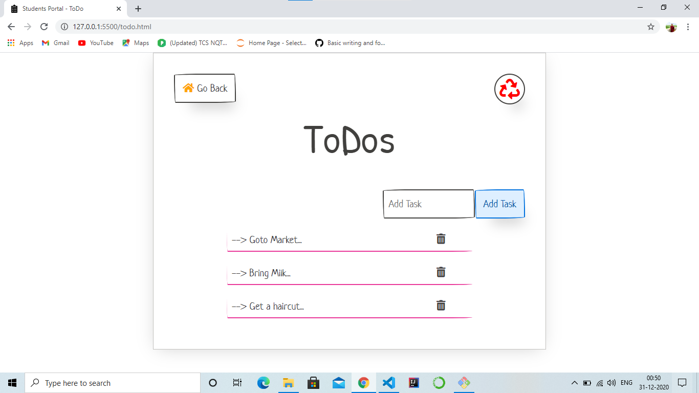
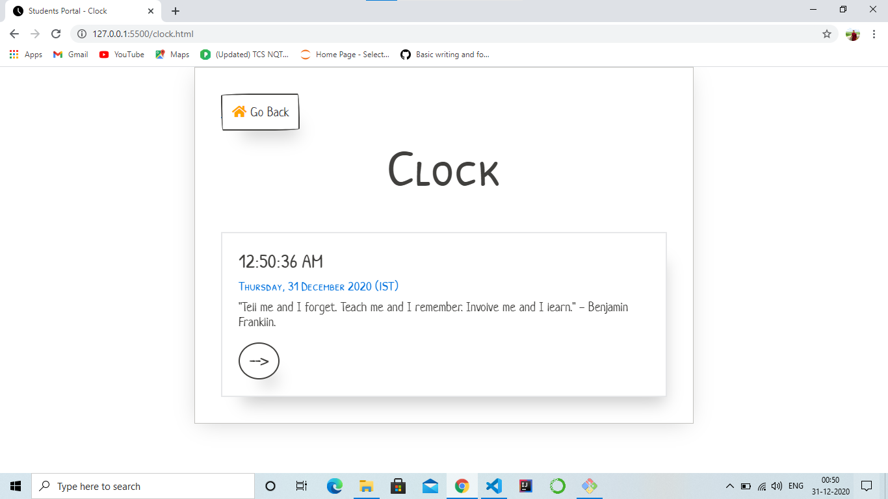
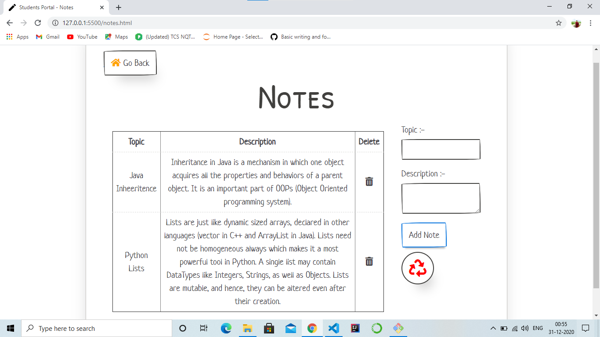

# Student-Portal
### A dashboard for students where they can organize their work at a single place.

### Functionalities 
1. Calculator  
2. ToDo List
3. Clock
4. Notes
#
1. **Calculator.**

2. **ToDo List.**

3. **Clock**

4. **Notes**
