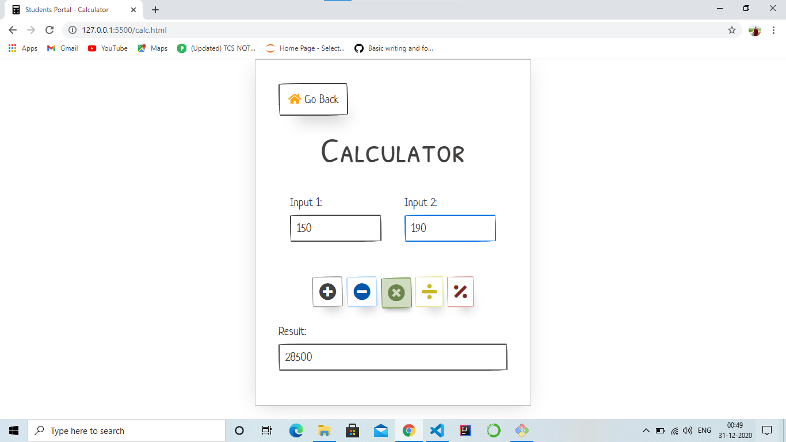

# Student-Portal
## A dashboard for students where they can organize their work at a single place.

#### Functionalities 
1. Calculator  
2. ToDo List
3. Clock
4. Notes

#### **Calculator.**
A simple calculator. You can add, subtract, multiply, divide, calculate modulus.

* **ToDo List.**
ToDo List, where you can add or remove ToDos. Everything is stored in the local storage. A clear button is there to clear all the ToDos.

* **Clock**
A simple clock. Followed by some quotes which update every 10 seconds.

* **Notes**
You can create Notes. You can set a topic and write some brief information. These are also stored in local storage. A clear button is to clear all the Notes.

